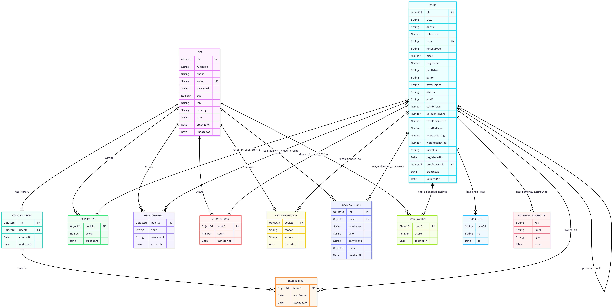

# Folio - Real-World Case Study and Data Model

## Real-World Case Study: Periplus (E-Commerce Bookstore)
**Company:** Periplus (sebagai inspirasi arsitektur)

**Use Case Researched:**
Manajemen katalog e-commerce berskala masif dengan operasi yang *read-heavy*. Periplus mengelola ratusan ribu SKU buku dengan atribut yang sangat bervariasi:
- **Buku Baru:** Hadir dengan fitur digital seperti e-book, voucher akses, dan CD resource.
- **Buku Lama/Arsip:** Hanya memiliki metadata dasar seperti judul, pengarang, dan tahun terbit.

**Pain Points di RDBMS:**
Sistem relasional konvensional tidak efisien dalam skenario ini karena mengharuskan skema tabel yang seragam. Setiap penambahan atribut baru pada buku edisi terbaru memaksa migrasi skema (`ALTER TABLE`) yang berdampak pada seluruh baris tabel. Akibatnya, tabel menjadi penuh dengan nilai `NULL` yang memboroskan alokasi memori dan memperlambat performa *query*.

**Solusi MongoDB (Folio):**
MongoDB dipilih karena mendukung *Schema Flexibility* (buku lama dan baru dapat hidup dalam skema *Hot* dan *Cold Shelf* yang berbeda tanpa *null-padding*), *Denormalized Embedding* (ulasan langsung tertanam dalam dokumen utama), dan *Materialized Views* lewat agregasi.

---

## Detailed Conceptual Data Model Diagrams

Struktur data dirancang menggunakan prinsip *schema-less* MongoDB dengan kombinasi tiga strategi: **Embedding**, **Referencing**, dan **Materialized Views**.

### Data Tiering Architecture Details

#### 1. Hot Shelf (Active Tier)
Buku modern dengan akses tinggi menggunakan arsitektur skema yang diisi sepenuhnya beserta *embedded comments* yang dibatasi (maksimal 10). Hal ini mengeliminasi kebutuhan tabel ulasan eksternal saat halaman pertama dimuat.

#### 2. Cold Shelf (Archived Tier)
Buku klasik hasil *mounting* arsip dengan akses rendah, diinisialisasi seminimal mungkin (tanpa *features*, *embedded_reviews*, dll) untuk mencegah penumpukan alokasi memori kosong di server MongoDB.
